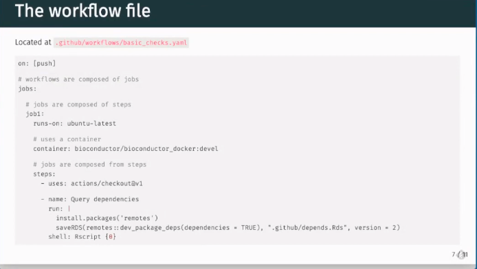
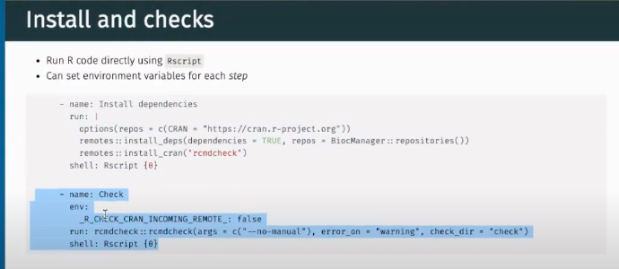
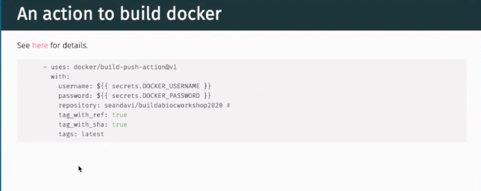

# CI with Github Actions

[https://www.youtube.com/watch?v=-OjwMal80KY&ab_channel=Bioconductor](https://www.youtube.com/watch?v=-OjwMal80KY&ab_channel=Bioconductor)

[https://docs.github.com/en/actions/quickstart](https://www.youtube.com/watch?v=-OjwMal80KY&ab_channel=Bioconductor)

#### Pros and cons compared to Travis 

- Cross platform testing 

- Better resource management

    - Create an equivalency between the process of building docker images and associated errors and the CI process 

    - Workshop automation and consistency 

    - 1) Prevent errors in versioning 

    - 2) Reproducibility across a cloud service for bioconductor, could be an option for us

#### Components/endgoals 

*   Standardized Docker images with dependencies for each course 
    *   Provide (new) course writers with a build environment close to other courses 
*   Potential cloud migration for BiocSwirl courses and BiocTerm 
*   Logs of processing for troubleshooting/debugging courses 
*   Provide CI/CD w/o extensive infrastructure and implement best practices of CI/CD 
*   Promotes code documentation
*   Pipelines are testable, reproducible, and have build version controlled artifacts 

#### Package Layout and Actions workflow

*   Normal Roxygen package w/ docker file - we currently do not have a dockerfile for our dev environment 
*   Github actions: 
    *   Live in a hidden directory called .workflows
    *   Our yml file is called mergecheck.yml
    *   [https://github.com/biocswirl-dev-team/automated_testing/tree/continuous_integration/.github/workflows](https://github.com/biocswirl-dev-team/automated_testing/tree/continuous_integration/.github/workflows)

#### Actions Breakdown (see also [https://github.com/seandavi/BuildABiocWorkshop/blob/master/.github/workflows/basic_checks.yaml](https://github.com/seandavi/BuildABiocWorkshop/blob/master/.github/workflows/basic_checks.yaml)) 

	- checkout (e.g. actions/checkout@v1)

	- R CMD CHECK 

	- R CMD INSTALL 

	- Rscript -r ‘swirl::course_install(github_url)’ # instead compile courses in swirl/swirlify? 

	- merge into master branch 

	- Course-specific Docker Image 

    
-[https://github.com/seandavi/bioconductor_docker](https://github.com/seandavi/bioconductor_docker)

Idea: Install CI on course-specific repos, create internal package containing custom testthat functions for testing courses. Figure out best way to test non-master branches in course install setting  

#### Notes on Github Actions Workflows:

- workflow jobs run independently of one another

- devel tag means current development bioconductor docker, in our case this depends on what version of docker we want and where to call it

- actions/checkout→ checks out repository in docker 

- run with shell Rscript runs R code   

Rcmd check is a meta check [https://github.com/r-lib/rcmdcheck](https://github.com/r-lib/rcmdcheck)

*   Based on how package interacts of entire user environments
*   What would this check for us?
    *   Testthat functions for BiocSwirl 
    *   Directory Integrity
    *   Hopefully check room? 
    *   Usethis action[ https://usethis.r-lib.org/ ](https://usethis.r-lib.org/)

-

 

[https://seandavi.github.io/BuildABiocWorkshop/articles/HOWTO_BUILD_WORKSHOP.html](https://seandavi.github.io/BuildABiocWorkshop/articles/HOWTO_BUILD_WORKSHOP.html)

Github action has matrix builds

*   Allows parallel workflows for diff. R versions for example 

Almas: 

Goal before next work session: Get a better understanding of Github actions

Steps:
 1. Read some github actions documentation

2. Maybe create some notes based on this

3. Have some ideas on how we can incorporate the stuff I’ve learned

[https://docs.github.com/en/actions/quickstart](https://docs.github.com/en/actions/quickstart)

Lisa: 

Goal: Identify workflow for github action (what tools/packages in what capacity), identify what a job should look like, and create a checklist for a basic job, and cross reference this with Sean’s docs

*   Diagram and checklist of what would be happening in workflow doc
*   List of tools and use cases for BiocSwirl Github Actions 

  
